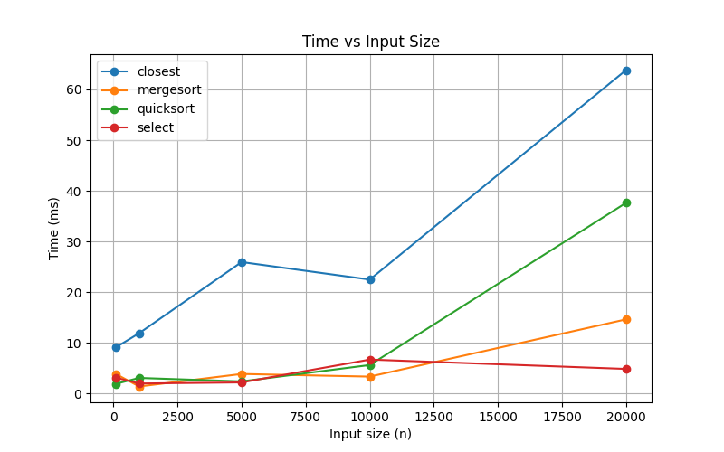
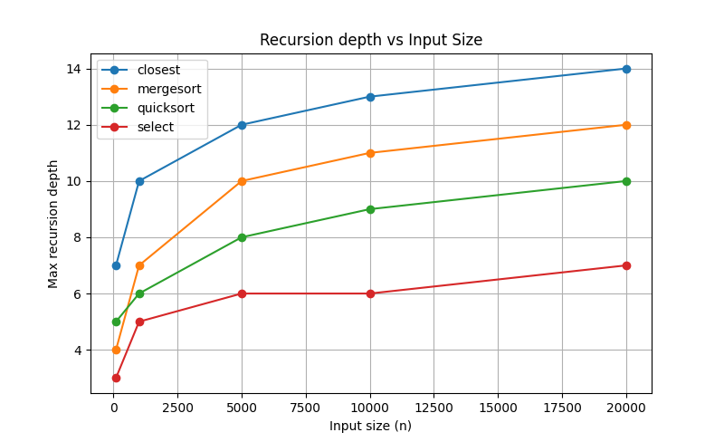

# Algorithms Benchmark

This repository contains three classic divide-and-conquer algorithms instrumented with metrics:
* **Quicksort** – random-pivot quicksort.
* **DeterministicSelect** – median-of-medians selection.
* **ClosestPair** – closest pair of points in the plane.

## Architecture and Metrics

All algorithms share a `Metrics` utility that uses `AtomicLong` counters to track:
* Number of comparisons and allocations.
* Current recursion depth and maximum depth reached.

Each recursive call explicitly calls `enterRecursion()` and `leaveRecursion()`, so depth is accurately counted even for non-tail recursion. Allocations can be incremented by 1 or by block size.  
The benchmark runner records elapsed time in nanoseconds and writes results to `results/benchmarks.csv`.

## Recurrence Analysis

**Quicksort.**  
We choose the pivot randomly and recurse on the smgit add README.mdaller partition iteratively. In expectation the recurrence is  
*T(n)=T(pn)+T((1−p)n)+Θ(n)* with *p≈1/2*, giving *Θ(n log n)*. In the worst case (rare with random pivot) depth reaches *Θ(n)*. Our depth metric shows how well the pivot choice balances.

**DeterministicSelect.**  
Uses groups of 5 and median-of-medians pivot. Only the relevant side of the array is recursed into; the other side is handled iteratively. The recurrence *T(n)=T(n/5)+T(7n/10)+Θ(n)* solves to *Θ(n)* (Akra–Bazzi / Master Theorem intuition). Depth grows logarithmically with *n*.

**ClosestPair.**  
Points are sorted once by *x* and *y*. Each step divides around the median x-coordinate and recurses on left and right sets; merging scans only the strip. Recurrence *T(n)=2T(n/2)+Θ(n)* gives *Θ(n log n)* by the Master Theorem. Depth is about *log₂ n*.

## Plots

### Time vs. n

### Recursion Depth vs. n

The plots confirm the theoretical shapes: quicksort and closest-pair scale as *n log n*, deterministic select is nearly linear. Depth stays logarithmic except for rare unbalanced quicksort pivots. Constant factors (e.g. copying arrays for ClosestPair, median sorting for Select) shift the curves but do not change asymptotic behaviour.
